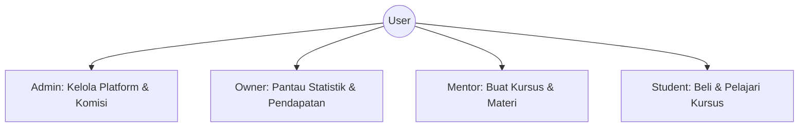
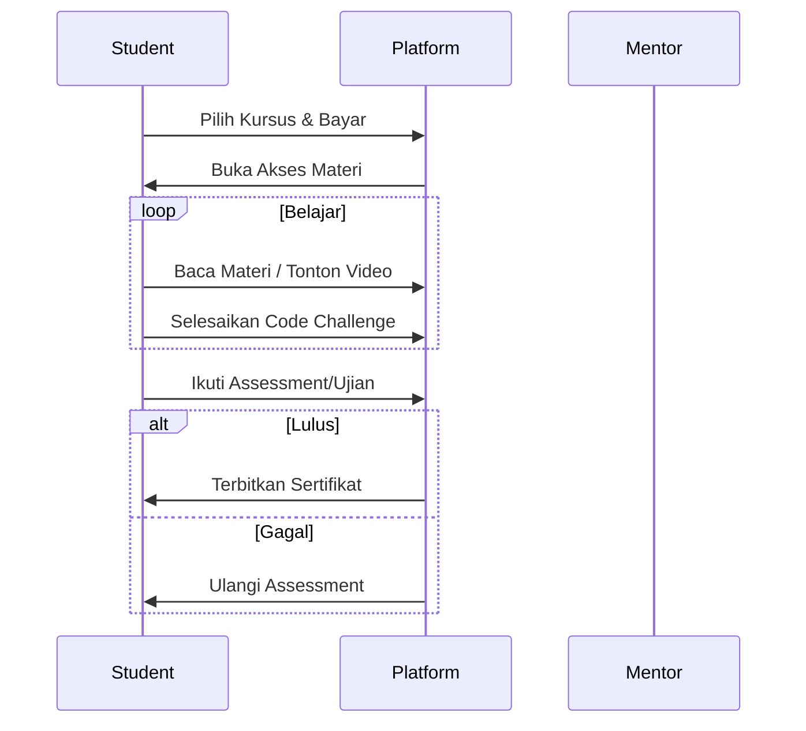

# LearnHub - Platform Kursus Online

LearnHub adalah platform manajemen pembelajaran (LMS) modern yang dibangun dengan Django. Platform ini mendukung peran Admin, Owner, Mentor (Penulis), dan Student (Pembaca).

## 🚀 Skema Sistem

### 1. Skema Akses Peran (User Roles)


### 2. Alur Pembelajaran (Learning Flow)


---

## 🛠️ Tech Stack

- **Backend:** Django 5.2.11+
- **Database:** MySQL (via Laragon)
- **Database Driver:** PyMySQL (dengan spoofing version untuk compatibility)
- **Frontend:** Django Templates + Tailwind CSS (via Unfold Admin)
- **Python Version:** 3.12 - 3.14.2+

---

## 📋 Prasyarat Instalasi

1. **Python 3.12+** (Disarankan Python 3.14 jika mengikuti setup ini).
2. **Laragon** (untuk MySQL server).
3. **Git**.

---

## ⚙️ Langkah-Langkah Instalasi

### 1. Clone Repository
```bash
git clone https://github.com/adrian-dev-art/learnhub.git
cd learnhub
```

### 2. Setup Virtual Environment (Opsional tapi Disarankan)
```bash
python -m venv venv
venv\Scripts\activate
```

### 3. Instal Dependensi
```bash
pip install -r requirements.txt
```

### 4. Setup Database (Laragon)
1. Buka Laragon.
2. Klik **Start All**.
3. Buka **Database** (HeidiSQL/phpMyAdmin).
4. Buat database baru bernama: `gampangbelajar`.

### 5. Setup Environment Variable
Pastikan file `.env` sudah ada di root folder (atau buat baru) dengan isi:
```env
DEBUG=True
SECRET_KEY=django-insecure-dev-key
ALLOWED_HOSTS=localhost,127.0.0.1
# Database Config (Default Laragon)
DB_NAME=gampangbelajar
DB_USER=root
DB_PASSWORD=
DB_HOST=127.0.0.1
DB_PORT=3306
```

### 6. Migrasi Database
```bash
python manage.py makemigrations
python manage.py migrate
```

### 7. Seed Data (Opsional)
Untuk mengisi database dengan data contoh (User, Kursus, Materi):
```bash
python manage.py seed
```

### 8. Jalankan Server
```bash
python manage.py runserver
```
Akses di: `http://127.0.0.1:8000`

---

## 🔑 Akun Default (Hasil Seeding)

Jika Anda menjalankan perintah `seed`, gunakan akun berikut:

| Peran | Username | Password |
| :--- | :--- | :--- |
| **Admin** | `admin` | `admin123` |
| **Owner** | `owner` | `owner123` |
| **Mentor** | `mentor1` | `password123` |
| **Student** | `student1` | `password123` |

---

## ⚠️ Catatan Penting untuk Python 3.14+
Karena Python 3.14 masih baru, proyek ini menggunakan **PyMySQL** yang telah dikonfigurasi di `config/__init__.py` untuk melakukan spoofing terhadap `mysqlclient`. Jangan menghapus baris berikut di file tersebut:
```python
import pymysql
pymysql.version_info = (2, 1, 1, "final", 0)
pymysql.install_as_MySQLdb()
```
